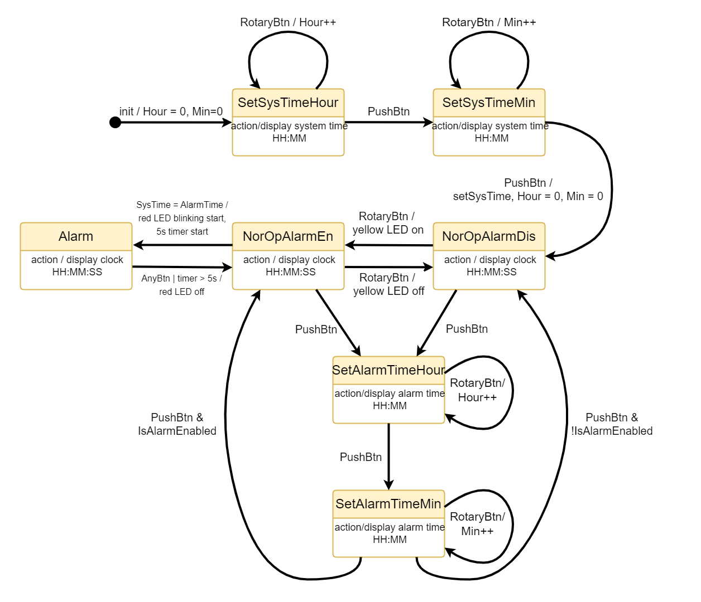

# RTOS for Alarm Clock
A Real-Time Operating System for Atmel AVR. Written in C. Build using PlatformIO. The state machine for the alarm clock is in the following image. The MCU board is equivalent to the Arduino Leonardo which uses ATmega32U4. Two different timers have been used. One timer (8-bit) with a time period of 1 ms is used for the scheduler, and another (16-bit) is used for software use with a 5 ms period.




## Bulding The Project
The project is built using avrdude (provided by the PlatformIO).

### System Dependencies:
- Python3 (for PlatformIO) 
- Visual Studio Code 
- PlatformIO IDE extension for VS Code
- gcc Compiler (or g++)

### Build

- Clone the git repository.
- Open the ses_workspace as VS Code workspace
- On the PIO Home choose ``` Open Project ```, select the ``` main ``` directory
- BUild using ``` PlatformIO:build ```
- Upload using ``` PlatformIO:upload ```. If asked for port choose the COM port that connected to the board (can be found in the device manager).

### .hex upload for Linux
For Linux, write access may be required. User group need to be in tty, dailout or uuct. Can be done as:
```
USERNAME=$(whoami)
sudo usermod -a -G tty $USERNAME
sudo usermod -a -G dialout $USERNAME
```
To take effect, a logout and login may be required.


## Pin Configuration

- Rotary Button input: PB5 
- Push Button input: PB4
- Green LED: PD2
- Red LED: PF5
- Yellow LED: PD3